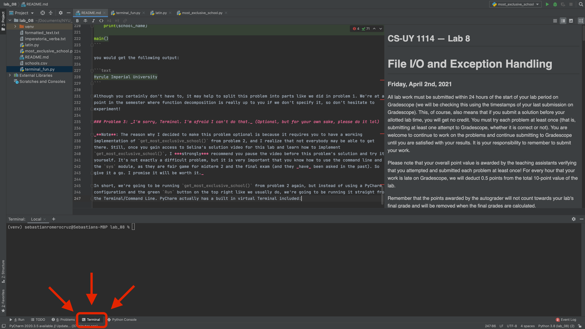

## CS-UY 1114 — Lab 8
# File I/O and Exception Handling
#### Friday, April 2nd, 2021

All lab work must be submitted within 24 hours of the start of your lab period on Gradescope (we will be checking this
using the timestamps of your last submission on Gradescope). This, of course, also means that if you submit a solution
before your allotted lab time, you will get no credit. You must try each problem at least once (that is, submitting at
least one attempt to Gradescope, whether it is correct or not). You are welcome to continue to work on the problems and
continue submitting to Gradescope until you are satisfied with your results. It is your responsibility to remember to
submit your work.

Please note that your overall point value is awarded by the teaching assistants verifying that you attempted and
submitted each problem at least once! For every hour that your work is late on Gradescope, we will deduct 0.5 points
from the total 10-point value of the lab.

Remember that the points awarded by the autograder will not count towards your lab's final grade and will be removed
when the final grades are calculated.
---

### Important Note on Lab Collaboration

While discussion of the lab problems is allowed amongst students in the course, when it is time to implement your
solution, the code must be **entirely** your own work. Submitting code that has been written by someone other than
yourself will, at a minimum, result in receiving a 0 on the lab assignment. Other possible penalties include having
the incident reported to the Office of Student Affairs to be added to your official academic record and/or failing the
course.

---

### Problem 1: _Imperatoria Interpres_

_**Note**: The instructions to this problem may seem very long, but the actual programming part is relatively short and
simple. Just calmly follow the steps I give, one by one, and ask questions if you have them!_

Constantinople is being invaded (what a surprise). As advisor to the Byzantine emperor, you are tasked with sending a
message to the Pope in Rome asking for reinforcements to help defend the city. Here's the problem: the emperor speaks
Greek, and his Latin is no great shakes. Still, he tried his hardest, and produced the following text:

```text
Adiuvate!
Amabo te!
Quomodo We're being attacked Latine dicas?
Voca Christiano exercitu!
Multas gratias vobis ago :)

- Romanorum imperatoris.
```

You don't worry too much about the emperor's atrocious Latin; you figure the Pope will understand. What you are more
worried about is that all official communications with the papacy must be written using the conventions of
[**classical Latin**](https://www.quora.com/Is-the-Roman-V-meant-to-mean-the-letter-U):
- All alphabetic characters must be written in uppercase.
- All `U` characters must be written as `V`.

We should probably fix the original imperial message and create a new one that will be meet the snobby standards of the
Papal States.

#### 1.1. `format_latin_text()`

In the file [**latin.py**](latin.py), write a function called **`format_latin_text()`** that will accept a string
(a good parameter name might be `unformatted_latin_text`), and **output** a string containing that same text, but formatted according to the
specifications above.

Consider the following sample behavior:

```python
def main():
   sample_unformatted_text = "Adiuvate! Mea navis volitans anguillis plena est!"
   formatted_sample_text = format_latin_text(unformatted_latin_text=sample_unformatted_text)
   print(formatted_sample_text)

main()
```
Output:
```text
ADIVVATE! MEA NAVIS VOLITANS ANGVILLIS PLENA EST!
```
You may assume that the input text will always be a valid string containing Latin text. This part is relatively simple
and, at the very least, doesn't involve any new material, so please make sure you get it working properly before
moving on. Ask your TAs if you're having any trouble!

#### 1.2 `get_unformatted_text()`

Okay, now that we have a working formatter, let's read the emperor's original letter. Let's say it comes in a `txt`
file; you know what this means.

In the file [**latin.py**](latin.py), write a function called **`get_unformatted_text()`** that will accept a single
string parameter (name this parameter `file_path` if you like) that will represent the name of the file containing the emperor's letter.
`get_unformatted_text()` will extract the full contents of the file (you may assume it will contain text only), close
the file, and return the contents ***in list form***.

Consider the following sample behavior, using the `txt` file [**imperatoria_verba.txt**](imperatoria_verba.txt):

```python
def main():
   sample_file_name = "imperatoria_verba.txt"
   contents = get_unformatted_text(file_path=sample_file_name)
   print(contents)

main()
```
Output:
```text
['Adiuvate!', 'Amabo te!', "Quomodo We're being attacked Latine dicas?", 'Voca Christiano exercitu!', 'Multas gratias vobis ago :)', '', '- Romanorum imperatoris.']
```
A few things to keep in mind here:
- You may **not** assume that the file containing the original text exists. Your program must make use of **`try`**,
**`except`**, and the exception `FileNotFoundError` to safely _attempt_ to open the file.
- In the case that the file doesn't exist, your program's attempt to safely open it will fail. If this happens, return
an empty string and end the program.
- Again, you may assume that the file will contain valid Latin text, but keep in mind that it must work with **any**
given file, not just the sample file we've included.
- Take note that none of the elements in our list include the newline character, `\n`.

It's ***very*** important that you successfully implement this part and understand how everything worked. If you're
having any trouble or doubts about it, do not hesitate to ask the TAs for help.

#### 1.3 `write_formatted_latin_file()`

We're finally in a position where we can create a properly formatted message befitting of a Roman emperor.

In the file [**latin.py**](latin.py), write a function called **`write_formatted_latin_file()`** that will accept the
following parameters:

| **Parameter Name** | **Type** | **Notes**                                                                                                          |
|--------------------|----------|--------------------------------------------------------------------------------------------------------------------|
|  `input_file_path` | `str`    | The name of the file containing the original message.                                                              |
| `output_file_path` | `str`    | **Optional**; use `output.txt` as its default value. The name of the file that will contain the formatted message. |

<sub><sup>**Table 1**: **`write_formatted_latin_file()`**'s parameters.</sup></sub>

Our function will do the following:
1. Create a new file using `output_file_path`, in which we will write our formatted message.
2. Using our function `get_unformatted_text()` from part 1.2, extract the contents of the file referenced by
`input_file_path`.
3. Line by line, format the elements returned by `get_unformatted_text()` (using our function `format_latin_text()` from
part 1.1) and...
4. ***Output the formatted lines*** into the file opened in step 1.
5. Close the file opened in step 1 (This, by the way, is absolutely obligatory every time you open a file without using
the **`with`** statement. Please don't forget to do it. Burn it into your brain.)

Consider the following sample behavior:

```python
def main():
   write_formatted_latin_file(input_file_path="imperatoria_verba.txt", output_file_path="formatted_text.txt")

main()
```
If everything was implemented correctly, you should see a new file in your `lab_08` folder called `formatted_text.txt`
with the following contents:
```text
ADIVVATE!
AMABO TE!
QVOMODO WE'RE BEING ATTACKED LATINE DICAS?
VOCA CHRISTIANO EXERCITV!
MVLTAS GRATIAS VOBIS AGO :)

- ROMANORVM IMPERATORIS.
```

This looks a lot more Roman and official-looking, doesn't it? Now you can sit back and wait for those famous Genoese
ships to (hopefully) sail into the Bosphorus.

### Problem 2: _They call them dream schools for a reason, right?_

Let's say you wanted to apply to the most exclusive state school (that is, funded by the government) in the country.
We have included a sample file [**schools.csv**](schools.csv) that includes data for a number of schools.

```csv
School Name,School ID,Year Founded,State,Avg Math SAT Score,Avg Reading SAT Score,Enrollment,Is State School?
Beauxbatons,32432,1290,Maine,528,531,10343,True
Nijigasaki University,3423,2004,New York,600,580,1202,False
Hyrule Imperial University,3,2069,New California,650,555,10020,True
Monsters University,45354,1994,Null,Null,Null,2345,True
Garreg Mach Officers Academy,543233,2002,Various,800,834,239,True
```

This is what is called a **CSV (comma-separated values) file**. As the name implies, files of this type contain
information separated by a certain character (most often, but not always, a comma `,`). They sometimes contain what's
called a **header**, which serves the purpose of telling us what each column of data represents.

The file will look something like this if opened in Excel:

| School Name                  | School ID | Year Founded | State                          | Avg Math SAT Score | Avg Reading SAT Score | Enrollment | Is State School? |
|------------------------------|-----------|--------------|--------------------------------|--------------------|-----------------------|------------|------------------|
| Beauxbatons                  | 32432     | 1290         | Maine                          | 528                | 531                   | 10343      | True             |
| Nijigasaki University        | 3423      | 2004         | New York                       | 600                | 580                   | 1202       | False            |
| Hyrule Imperial University   | 3         | 2069         | Neo California                 | 650                | 555                   | 10020      | True             |
| Monsters University          | 45354     | 1994         | Null                           | 450                | 4564                  | 2345       | True             |
| Garreg Mach Officers Academy | 543233    | 2002         | Imperial Capital of Washington | 800                | 834                   | 239        | True             |

<sub><sup>**Table 2**: Tabular representation of data inside [**schools.csv**](schools.csv).<sub><sup>

Your goal is to write a function called **`get_most_exclusive_school()`** in the file
[**most_exclusive_school.py**](most_exclusive_school.py) that will return the **name** of the **state** school with the
highest SAT score (that is, with the highest `Avg Math SAT Score` + `Avg Reading SAT Score` added together). Your
function will accept one parameter, `file_path`, denoting the name of the file. While we provided a sample file, keep in
mind that the autograder will generate its own file using random numbers and values, so your function must work
accordingly!

A few things you should note when starting this problem:

1. Your program must first **attempt** to open the file that corresponds to the file name that was passed in to your
function. If the file name points to a file that does not exist, your program should stop, and return an empty string.
(_HINT_: **`try`**, **`except`**, and **`FileNotFoundError`**).
2. As you can see, certain lines in your CSV file will have SAT scores that go above the highest possible score (in our
case, this value is 1800); make sure to check that the values you are considering are valid before actually using them!
If a school contains invalid SAT score values, you may safely skip it.
3. If there are two state schools with the same highest SAT average scores (a possibility, since the file will be
pseudo-randomly generated), return the name of the state school that is listed last.
4. You may assume that at least one school will contain valid SAT scores and `Is State School?` values.

If we ran the following sample program:

```python
def main():
   school_name = get_most_exclusive_school("schools.csv")
   print(school_name)

main()
```

you would get the following output:

```text
Hyrule Imperial University
```

Although you certainly don't have to, it may help to split this problem into parts like we did in problem 1. We're at a
point in the semester where function decomposition is expected but determined by your own intuition if we don’t specify a decomposition strategy, so don't hesitate to
experiment!

### Problem 3: _I'm sorry, Terminal. I'm afraid I can't do that._ (Optional, but for your own sake, please do it)

_**Note**: The reason why I decided to make this problem optional is because it requires you to have a working
implementation of `get_most_exclusive_school()` from problem 2, and I realize that not everybody may be able to get
there. Still, once you gain access to Selina's solution video for this lab and learn how to implement
`get_most_exclusive_school()`, I ***strongly*** recommend you pause the video before this problem's solution and try it
yourself. It's not exactly a difficult problem, but it is very important that you know how to use the command line and
the `sys` module, as they are fair game for midterm 2 and the final exam (and they _have_ been asked in the past). So
give it a go. I promise it will be worth it._

In short, we're going to be running `get_most_exclusive_school()` from problem 2 again, but instead of using a PyCharm
configuration and the green `Run` button on the top right like we usually do (in fact, I didn't even include a
configuration for this problem), we're going to be running it straight from the Terminal/Command Line. PyCharm actually
has a built-in virtual Terminal included:



<sub><sup>**Figure 1**: How to access PyCharm's virtual Terminal/Command Line.<sub><sup>

Our goal is to give the user the ability to run `get_most_exclusive_school()` by typing the following command into the Terminal:
```text
python3 terminal_fun.py schools.csv
```
The three pieces of this command tells us the following:
- `python3` instructs the Terminal that we want it to use the Python 3 interpreter. (`py` on Windows machines).
- `terminal_fun.py` instructs the operating system that the program we want to run using the Python 3 interpreter is a file
called `terminal_fun.py`.
- `schools.csv` itself doesn't tell us much, but presumably, `terminal_fun.py` will utilize a file called `schools.csv`
somewhere in its implementation. In our case, we know we need `schools.csv` to run `get_most_exclusive_school()`, so we,
as members of CS 1114, know what to use it with.

Now, as you learned in class, in order to access `get_most_exclusive_school()` inside
[**terminal_fun.py**](terminal_fun.py), we need to **import** it. This works exactly the same way as importing the
`math` and `random` modules. Turns out, we've been writing our own modules all along! Look at us, bona fide programmers.

At the top of your file, you simply have to include this line to get access to `get_most_exclusive_school()` in
`terminal_fun.py`:

```python
import most_exclusive_school

most_exclusive_school.get_most_exclusive_school("sample_file.csv")
```
Or, if you want to reduce the amount of typing required:
```python
from most_exclusive_school import get_most_exclusive_school

get_most_exclusive_school("sample_file.csv")
```

(**Note**: This will only work if the file `most_exclusive_school.py` exists in the same directory as `terminal_fun.py` which,
in our case, it does.)

Great. Your next step is to extract the arguments that the user enters in the Terminal into your program. You know from
class that you have to use the `argv` attribute of the `sys` module. If you need a refresher on how it works, please
look back at the lecture slides and/or the
[**official documentation**](https://docs.python.org/3/library/sys.html#sys.argv) for this attribute.

Now, at this point I'd usually tell you to assume that the user will enter the correct arguments and/or number of
arguments, but the reality is that often (more often than you think, actually) the user will screw up and enter the wrong
values. Your entire program will crash because of something that wasn't even your fault.

For this reason we will want to implement the following safeguards:

- Once you extract the arguments the user entered into the Terminal using `argv`, check that they entered **only 2
arguments**. That is, only the name of the program (`terminal_fun.py`) and the name of the CSV file we're reading
(`schools.csv`). If the user entered more than or less than 2 arguments, print the following message, which we'll call
our **usage message** from now on:
```text
USAGE: python3 [.PY FILE NAME] [.csv FILE NAME]
```
- If the user entered exactly 2 arguments, our next step is to **check that the extension of the second argument is
`.txt`**. The key to doing this is the `split()` string method, since a valid file would be comprised of a file name and
its extension seperated by a `.`. If the user didn't enter a `.txt` file as their second argument, print the usage
message.
- If they did enter a valid `.txt` file, then we're ready to run `get_most_exclusive_school()` using the arguments
passed by the user.

Once you get the result of `get_most_exclusive_school()`, simply print it to make sure it worked.

Here are some sample executions (executed on my machine):

#### Call #1: The user did everything correctly
```text
(venv) sebastianromerocruz@Sebastians-MBP lab_08 % python3 terminal_fun.py schools.csv
```
Result:
```text
Hyrule Imperial University
```

#### Call #2: The user entered too many arguments
```text
(venv) sebastianromerocruz@Sebastians-MBP lab_08 % python3 terminal_fun.py schools.csv latin.py
```
Result:
```text
USAGE: python3 [.PY FILE NAME] [.csv FILE NAME]
```

#### Call #3: The user entered a file with an incorrect extension (`.txt` instead of `.csv`)
```text
(venv) sebastianromerocruz@Sebastians-MBP lab_08 % python3 terminal_fun.py imperatoria_verba.txt
```
Result:
```text
USAGE: python3 [.PY FILE NAME] [.csv FILE NAME]
```

#### Call #4: The user did not enter enough arguments
```text
(venv) sebastianromerocruz@Sebastians-MBP lab_08 % python3 terminal_fun.py
```
Result:
```text
USAGE: python3 [.PY FILE NAME] [.csv FILE NAME]
```
